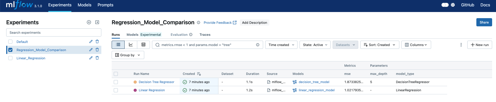

# Regression Models with MLflow Tracking and Model Serving
### (Linear Regression & Decision Tree)
Minimal examples of training and comparing two regression models using scikit-learn — **Linear Regression** and **Decision Tree Regressor** — with MLflow used for tracking, logging, and serving models as REST APIs.


## Update

- Added a **Decision Tree Regressor** model alongside the original Linear Regression.
- Both models are now trained and logged within the same script (`mlflow_train_models.py`).
- Each model is tracked in a separate MLflow run to enable side-by-side evaluation.
- The **Linear Regression** implementation remains unchanged and continues to log parameters, metrics, model files, input signature, and input examples.


</br>


</br>

## Requirements

- Install the pip packages:

```bash
pip install mlflow scikit-learn pandas numpy
```

## Steps to Run

-  Train the Model and Log with MLflow
```
python mlflow_linear_regression.py
```

- Start the MLflow Tracking UI
```
mlflow ui --port 6006
```

-  Serve the Trained Model as REST API
```
mlflow models serve -m mlruns/0/<run_id>/artifacts/linear_regression_model -p 1234 --no-conda 
```

(You can also get the url from the mlflow UI under Artifacts)


- Make Predictions via API 

```
curl -X POST http://127.0.0.1:1234/invocations \
  -H "Content-Type: application/json" \
  -d '{
    "dataframe_split": {
      "columns": ["x"],
      "data": [[2.5], [7.0]]
    }
  }'
```

- OR use python requests example `request_eg.py`


